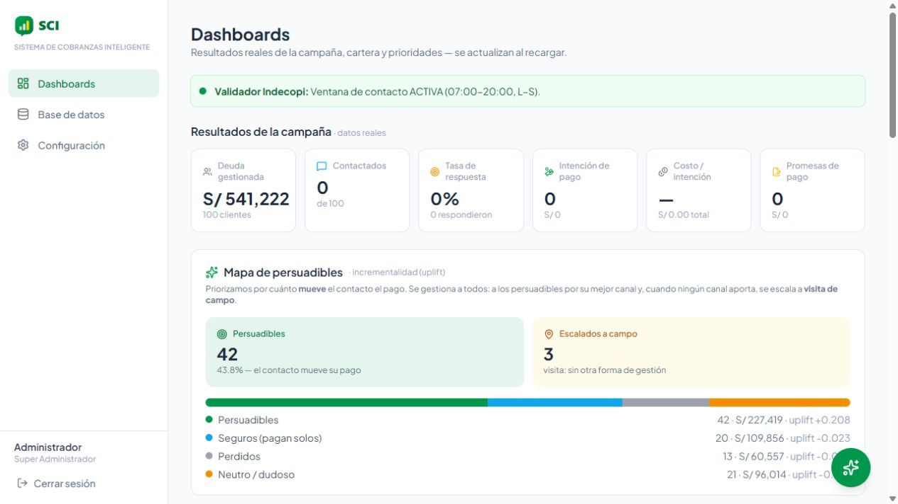

# SCI · Sistema de Cobranzas Inteligente

**Proyecto colaborativo · Python / FastAPI · React / TypeScript · Automatización e IA**

MVP para explorar cómo priorizar una cartera de cobranza, seleccionar canales de contacto y seguir sus resultados desde un dashboard. Esta edición de portafolio permite revisar el código y ejecutar el sistema localmente con **100 registros sintéticos**.

**[Perfil de Alejandro](https://github.com/alejandrobugs02-code) · [Arquitectura](ARQUITECTURA.md) · [Estrategia de producto](ESTRATEGIA.md) · [Guía técnica](GUIA_TECNICA.md)**



> Captura de la aplicación funcionando con la cartera de demostración. Los montos, segmentos y proyecciones son datos de prueba; no representan resultados obtenidos en una entidad financiera.

## El problema y la propuesta

Contactar a todos los clientes por el mismo canal ignora diferencias de costo, disponibilidad y respuesta. SCI reúne la cartera, un motor de recomendación por canal y métricas de campaña para ayudar a explorar decisiones de cobranza.

| Área | Qué permite revisar |
| --- | --- |
| Aplicación web | Dashboard, cartera paginada, importación CSV/XLSX y configuración |
| Backend | API REST con FastAPI, persistencia con SQLModel/SQLite y autenticación JWT |
| Decisiones | Recomendaciones a partir de uplift, costos, disponibilidad y reglas de priorización |
| Automatización | Ejecución por canales y separación de gestiones automatizadas y humanas |
| Integraciones | Adaptadores para WhatsApp, Twilio, Vapi y proveedores LLM |
| Producto | Estrategia, arquitectura, backlog y especificación de requerimientos |

## Autoría y participación

Desarrollado en colaboración por **Alejandro ([alejandrobugs02-code](https://github.com/alejandrobugs02-code))** y **[adriannmq0205](https://github.com/adriannmq0205)**.

Alejandro participó en el desarrollo del proyecto y mantiene esta edición pública para su portafolio. La autoría del sistema es compartida; este repositorio no atribuye todos los módulos a una sola persona.

La edición parte del estado `6590d1c` del repositorio colaborativo SCI, compartido por su propietario para su publicación. Se inicia un historial público separado para no exponer versiones antiguas del repositorio privado. Los créditos del trabajo original se conservan aquí.

## Ejecutarlo localmente

Requisitos: **Python 3.12** y **Node.js 22 o superior**. No necesitas credenciales de proveedores para iniciar sesión y consultar la cartera y el dashboard.

```bash
git clone https://github.com/alejandrobugs02-code/SCI.git
cd SCI/backend
python -m venv .venv
```

Activa el entorno: `.venv\Scripts\Activate.ps1` en PowerShell o `source .venv/bin/activate` en macOS/Linux. Después:

```bash
python -m pip install -r requirements.txt
python -m uvicorn app.main:app --host 127.0.0.1 --port 8000
```

En otra terminal, desde la raíz del repositorio:

```bash
cd frontend
npm ci
npm run dev
```

Abre **http://localhost:5173**. Acceso de demostración local: `admin` / `admin123`; rol de consulta: `visor` / `visor123`. La documentación de la API está en **http://127.0.0.1:8000/docs**.

### Recorrido sugerido

1. Explora la distribución de cartera y los segmentos en **Dashboards**.
2. Abre **Base de datos** para consultar registros y recomendaciones.
3. Revisa **Configuración** para conocer los parámetros de decisión.
4. Para probar campañas, conserva **Simular** activado y las credenciales externas vacías. La validación horaria puede impedir la ejecución fuera de la ventana configurada.

## Alcance de la demostración

- Es un MVP de portafolio, sin despliegue productivo ni resultados comerciales verificados.
- La cartera incluida es sintética. Sus teléfonos de ejemplo no deben usarse para envíos reales.
- El asistente conversacional y los envíos reales requieren cuentas y credenciales externas; no están incluidos en las pruebas de esta edición.
- Las reglas normativas y las estimaciones de uplift requieren validación específica antes de uso real. Una diferencia observada entre grupos no acredita por sí sola un efecto causal.
- Las credenciales y la clave JWT predeterminadas son exclusivamente para uso local. No expongas esta configuración a Internet.
- Los documentos de diseño describen también objetivos y trabajo pendiente; no constituyen una certificación de funcionalidades o rendimiento.

## Validación

```bash
# Desde frontend/
npm run build

# Desde backend/, con las dependencias instaladas
python -m unittest discover -s tests -v
```

La prueba de integración usa una base temporal: arranque, autenticación, acceso protegido, analítica y plan de campaña. No envía mensajes ni llama a proveedores externos.

## Documentación

- [Arquitectura técnica](ARQUITECTURA.md)
- [Estrategia de producto](ESTRATEGIA.md)
- [Guía técnica de integraciones](GUIA_TECNICA.md)
- [Backlog de historias de usuario](docs/Historias_de_Usuario_SCI.xlsx)
- [Especificación de requerimientos](docs/Requerimientos_SCI.docx)

La guía original menciona scripts de generación documental que no forman parte de esta edición; los documentos ya generados sí están incluidos.
